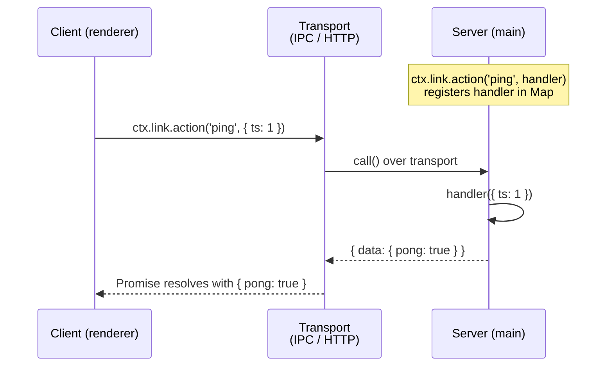
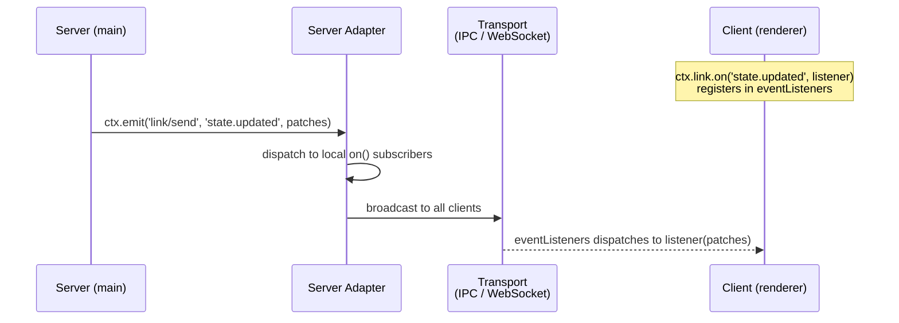

# @satoriapp/link

Abstract communication layer between frontend and backend in the Satori Desktop architecture. Built on [Cordis](https://github.com/cordiverse/cordis).

`Link` is a Cordis Service that provides two communication primitives:

- **action** — request/response (client calls, server handles)
- **event** — push/subscribe (server pushes via Cordis event, client subscribes)

Transport is pluggable. The abstract `Link` base class defines the contract; concrete adapters implement the transport:

| Adapter | Transport | Package |
|---------|-----------|---------|
| `LinkIpc` / `LinkIpcClient` | Electron IPC | `@satoriapp/plugin-link-ipc` |
| `LinkWeb` / `LinkWsClient` | HTTP POST + WebSocket | `@satoriapp/plugin-link-web` |

## Architecture

### Action (request/response)



### Event (push/subscribe)



## Usage

### Registering actions (server-side)

```ts
// Returns a disposer function
const dispose = ctx.link.action('message.create', async (payload) => {
  const message = await ctx.message.create(payload)
  return { message, updatedAt: Date.now() }
})
```

### Invoking actions (client-side)

```ts
const result = await ctx.link.action('message.create', {
  platform: 'discord',
  channelId: '12345',
  content: 'hello',
})
// result = { message: {...}, updatedAt: 1711... }
```

On error, `action()` throws a `LinkError` with `.code` and `.message`.

```ts
import { LinkError } from '@satoriapp/link'

try {
  await ctx.link.action('missing.route', {})
}
catch (err) {
  if (err instanceof LinkError) {
    console.log(err.code) // 'ENOENT'
    console.log(err.message) // 'action not registered: missing.route'
  }
}
```

### Pushing events (server-side)

Event push uses the Cordis event bus, not a method on `Link`. Server adapter plugins subscribe to `link/send` and broadcast to connected clients.

```ts
ctx.emit('link/send', 'state.updated', patches)
```

### Subscribing to events (client-side)

```ts
// Returns a disposer function
const dispose = ctx.link.on('state.updated', (patches) => {
  applyPatches(patches)
})
```

## Type-safe events

Declare event types via module augmentation on `Link.Events`:

```ts
import type { Link } from '@satoriapp/link'

declare module '@satoriapp/link' {
  namespace Link {
    interface Events {
      'state.updated': (patches: Patch[]) => void
      'message.created': (message: SerializedMessage) => void
    }
  }
}
```

After augmentation, `ctx.link.on('state.updated', ...)` infers the listener signature automatically. Unknown event names fall back to `Link.Listener<T>`.

## Implementing an adapter

Extend `Link` and implement `call()`. Override `handle()` and `on()` as needed for server-side behavior.

```ts
import { Link } from '@satoriapp/link'

// Client adapter — only needs call()
export class MyClient extends Link {
  protected async call<T, R>(path: string, payload?: T): Promise<Link.Response<R>> {
    // Send request over your transport, return { id, data } or { id, error }
  }
}

// Server adapter — override handle() + listen to link/send
export class MyServer extends Link {
  async start() {
    // Set up transport listener for incoming requests

    // Forward link/send events to connected clients
    this.ctx.on('link/send', (event, data) => {
      for (const l of this.eventListeners.get(event) ?? []) l(data)
      this.broadcastToClients(event, data)
    })
  }

  protected handle<T, R>(path: string, handler: Link.ActionHandler<T, R>) {
    this.handlers.set(path, handler)
    return () => this.handlers.delete(path)
  }

  protected async call<T, R>(path: string, payload?: T): Promise<Link.Response<R>> {
    // Local handler lookup for server-side action() calls
    const handler = this.handlers.get(path)
    if (!handler)
      return { id: path, error: { code: 'ENOENT', message: 'not found' } }
    return { id: path, data: await handler(payload) as R }
  }
}
```

## API Reference

### `Link` (abstract class, extends `Service`)

| Member | Type | Description |
|--------|------|-------------|
| `action(path, handler)` | `() => void` | Register a handler, returns disposer |
| `action(path, payload?)` | `Promise<R>` | Invoke a remote action |
| `on(event, listener)` | `() => void` | Subscribe to pushed events, returns disposer |

### `Link.Events`

Extensible interface for type-safe event declarations. Augment via `declare module '@satoriapp/link'`.

### `Link.ErrorCode`

| Code | Meaning |
|------|---------|
| `ENOSYS` | Transport not available |
| `ENOTCONN` | Not connected |
| `ETIMEOUT` | Request timed out |
| `ENOENT` | Action not registered |
| `EIPC` | IPC transport error |
| `EDISPOSED` | Service disposed |
| `EINTERNAL` | Handler threw an error |

### Cordis events

| Event | Emitted by | Description |
|-------|-----------|-------------|
| `link/status` | Adapters | Connection status change |
| `link/send` | Server-side code | Push data to all connected clients |
